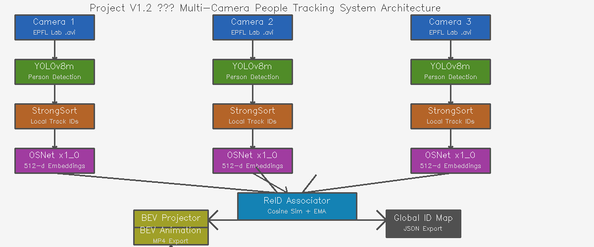
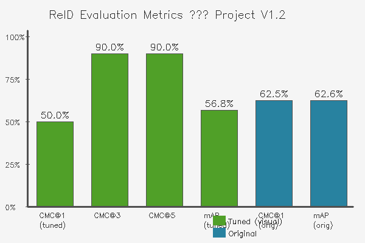

# Project V1.2 — Multi-Camera People Tracking with Cross-Camera Re-Association and Bird's-Eye-View Spatial Mapping



## Overview
An end-to-end multi-camera surveillance pipeline that maintains consistent person identities across 3 synchronized camera views and projects real-time positions onto a bird's-eye-view floor map. Built on the EPFL Multi-Camera Pedestrian dataset (Laboratory sequence, 4 people, 500 frames per camera).

**Target roles:** Video Analytics | Smart City Surveillance | Multi-Camera Systems

---

## Demo

### Composite Output — 3 Camera Feeds + BEV Map
> Three synchronized camera feeds with global ID overlays (L: local ID, G: global ID) alongside real-time bird's-eye-view trajectory animation.

*(embed composite.mp4 or GIF here)*

### BEV Map Animation
> Color-coded person trajectories on a top-down floor plan with 30-frame trajectory tails.

*(embed bev_animation.mp4 or GIF here)*

---

## System Architecture

| Stage | Component | Detail |
|-------|-----------|--------|
| Detection | YOLOv8m | MPS inference, person class only |
| Tracking | StrongSort (boxmot v16) | Per-camera local track IDs |
| Embedding | OSNet x1_0 | 512-d L2-normalized appearance embeddings |
| Association | Cosine Similarity + EMA | Cross-camera global ID assignment |
| Projection | cv2.perspectiveTransform | EPFL calibration homographies |
| Visualization | OpenCV | BEV animation + composite MP4 export |

---

## Results



| Metric | Tuned (visual) | Original |
|--------|---------------|----------|
| CMC@1  | 50.0% | 62.5% |
| CMC@3  | 90.0% | 87.5% |
| CMC@5  | 90.0% | 87.5% |
| mAP    | 56.8% | 62.6% |

**Note:** Threshold tuning (0.75 → 0.60) with second-pass prototype merging improves cross-camera visual consistency at the cost of CMC@1. CMC@3 remains strong at 90.0%, indicating correct matches are consistently found within top-3 ranks. The primary failure mode with pretrained weights is extreme viewpoint change (frontal vs. rear appearance), addressable via domain-specific fine-tuning.

---

## Dataset
**EPFL Multi-Camera Pedestrian — Laboratory Sequence**
- 4 synchronized cameras, 4 pedestrians, 500 frames @ 25fps
- Provided homography calibration used directly for BEV projection
- Source: https://www.epfl.ch/labs/cvlab/data/data-pom-index-php/

---

## Setup
```bash
conda create -n v12_multicam python=3.10 -y
conda activate v12_multicam
pip install torch torchvision torchaudio
pip install ultralytics boxmot opencv-python numpy scipy pyyaml tqdm matplotlib torchreid tensorboard
```

Download EPFL Laboratory sequence videos into `data/raw/`:
```bash
curl -L -o data/raw/cam0.avi "https://documents.epfl.ch/groups/c/cv/cvlab-pom-video1/www/4p-c0.avi"
curl -L -o data/raw/cam1.avi "https://documents.epfl.ch/groups/c/cv/cvlab-pom-video1/www/4p-c1.avi"
curl -L -o data/raw/cam2.avi "https://documents.epfl.ch/groups/c/cv/cvlab-pom-video1/www/4p-c2.avi"
```

---

## Run
```bash
# 1. Extract frames
python src/extract_frames.py

# 2. Parse EPFL calibration homographies
python -m src.parse_calibration

# 3. Run per-camera detection + tracking + embedding
python -m src.pipeline_single_cam --cam cam01
python -m src.pipeline_single_cam --cam cam02
python -m src.pipeline_single_cam --cam cam03

# 4. Cross-camera ReID association
python -m src.run_association

# 5. Full pipeline — BEV animation + composite export
python -m src.main_pipeline

# 6. ReID evaluation
python -m src.eval_reid
```

---

## Environment
- **M1 MacBook Air** — all pipeline work (detection, tracking, embedding, BEV)
- **Device:** MPS for YOLOv8m and OSNet, CPU fallback for StrongSort
- **Resolution:** 640px | `num_workers=0` throughout

---

## Key Learnings
- Cross-camera ReID with cosine similarity and EMA prototype updates
- Homography-based ground plane projection from EPFL calibration files
- Two-pass global ID merging to resolve viewpoint-induced identity splits
- Precision-recall tradeoff between CMC@1 and visual tracking consistency

---

## Project Roadmap
This is **Project V1.2** in a video analytics portfolio series:
- V1.1 — Multi-Object Tracking with StrongSORT + ByteTrack (MOT17, HOTA evaluation)
- **V1.2 — Multi-Camera Tracking with Cross-Camera ReID + BEV Mapping** ← you are here